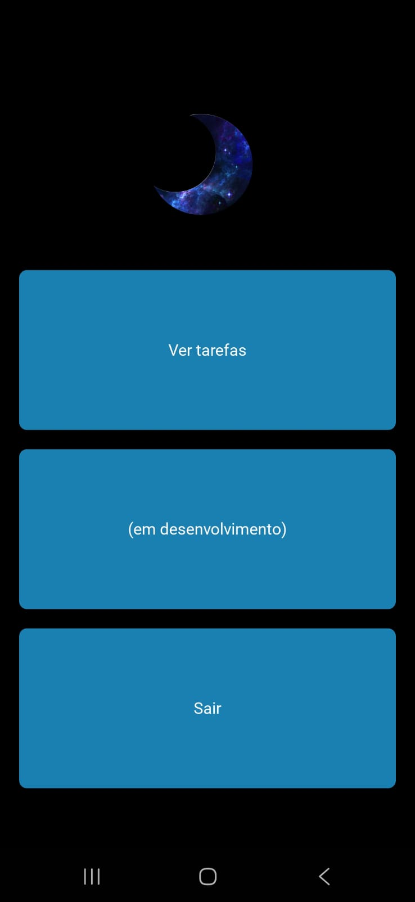
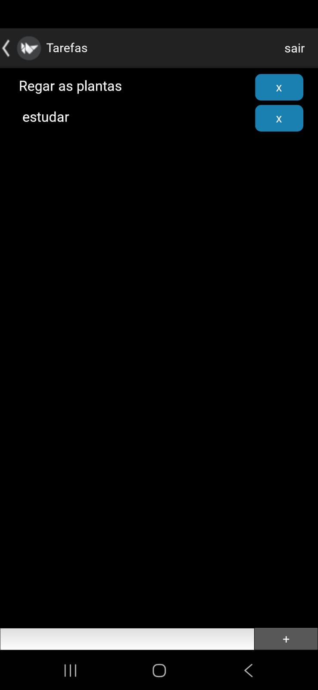

# Aplicativo de Lista de Tarefas

Este projeto é um aplicativo simples para **gerenciamento de tarefas e afazeres**, desenvolvido com foco em ajudar na organização pessoal do usuário final.

---

## Descrição

O aplicativo permite criar, armazenar e gerenciar tarefas utilizando uma interface gráfica intuitiva.  
As informações são salvas localmente em arquivos JSON, facilitando o uso mesmo sem conexão com a internet.
funciona 

---

## Demonstração

<p align="center">
  
  
</p>

---

## Tecnologias Utilizadas

- [Python](https://www.python.org/) — linguagem principal do projeto
- [Kivy](https://kivy.org/) (v2.3.1) — framework para construção de interface gráfica (GUI)
- [JSON](https://www.json.org/json-en.html) — utilizado para armazenar e recuperar dados localmente

---

## Instalação

### Baixar APK

[Download](https://github.com/Jovito5s9/app_de_listas/releases/tag/v0.1)

### Pré-requisitos

- Ter o [Python](https://www.python.org/downloads/) instalado (versão 3.10 ou superior recomendada)

### Passos para instalar

1. Clone o repositório:

```bash
git clone https://github.com/Jovito5s9/app_de_listas.git
cd app_de_listas

